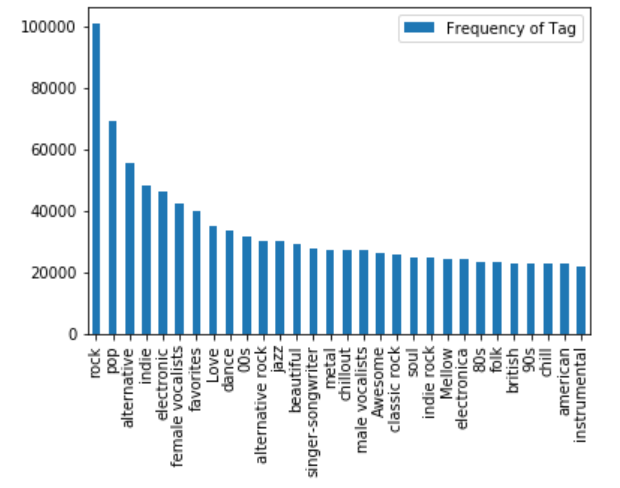

Our project utilized two primary data sources:
* [The Million Song Dataset](https://labrosa.ee.columbia.edu/millionsong/lastfm)
* [The Million Playlist Dataset](http://recsys-challenge.spotify.com)

## Million Songs Dataset

The Million Song Dataset contains the top one million songs played on Spotify, by number of plays. We began by cleaning the data. We uploaded the list of songs as a text file, and ran a for loop by line, and used the split method to separate the artist name and track name. Next, we made a function to generate the tags using the last.fm API, and created a function that cleaned (again using the split method) and added tags in a list based on the artist and track names. Lastly, we loaded all of the cleaned data into a pandas dataframe, and added a column counting the number of tags attached to each song.

To explore the data, we initially looked at the first 500 unique tracks. For each song in this dataset, we were interested in retrieving the following information:
* Track name
* Artist
* Number of tags
* User-generated tags

We next performed some additional exploratory analysis to look at the average number of tags per song, the number of songs tagged with each genre, and the proportion of songs.

**Figure 1: Histogram of Number of Songs (Y) and Number of Tags (X) from the Million Songs Dataset**

An important insight from the initial data exploration of the first 500 unique songs in the Million Songs Dataset is that 80% have very few tags (between 0 and 10). This could be the case that only a few tags are actually valuable. As a group, we will therefore have to make decisions about how to deal with songs that have very few or no tags. For example, we can generate our own tags or simply eliminate these songs from consideration. 

**Figure 2: Top 30 Most Popular Tags from the Million Songs Dataset**

Another insight is that not all the tags are actually valuable for our analysis. Some tags were extremely specific and applied only to one song (“v0k4l j4zz”). We decided that for our project we were interested in just the top tags. Some of these tags include:
* Rock
* Pop
* Alternative/indie (combined tags)
* Electronic
* Dance
* Metal
* Jazz
* Folk
* Instrumental

## Million Playlist Dataset

The Million Playlist Dataset contains the top one million playlists on Spotify, by number of followers. We cleaned the data by writing two python scripts: one to load the dataset into a csv file, and another to clean the data. We cleaned the data by normalizing names of the playlists (rewrote names in lowercase, removed special characters, and removed extraneous spaces) and removing irrelevant columns (collaborative, modified at, number of edits).

To explore the data, we initially looked at the first 1,000 playlists. We pulled the following information:
* Duration of playlists in minutes
* Time when playlist was last edited
* Number of albums in each playlist
* Number of artists in each playlist
* Number of followers in each playlist
* Number of tracks in each playlist

**Figure 3: Top 15 Most Popular Playlist Names from Million Playlist Dataset**

The key insight from this bar plot is that there are massive numbers of playlists that have the same title. From this data, there appear to be distinct clusters of types of playlists (“workout”, “rap”, etc.). Since there are apparently niche types of playlists, this supports our hypothesis that playlist information could be valuable for suggesting playlists.

## Literature Review

The literature points to five key challenges facing those creating automatic playlist generators. These include:
* Sequential consumption - listeners listen to playlists in a specified order and may have preferences related to that order. For example, listeners may not want to listen to the same artist two songs in a row.
* Preference for repeat recommendations - listeners may want to hear the same song twice as long as there is a sufficient gap.
* Background listening - people often listen to music passively so might not skip a song if they don't like it, making skipping an inaccurate signal.
* Context - what a person wants to listen to is emotion, location, time, weather and event-dependent, and music generators must find ways to update according to these contextual factors.
* A lack of contextual information (in the cold start problem).

The literature also covers a number of ways to determine song 'similarity', for example by looking at musical tempo, instrumental, or timbre similarity. However, we felt that this methods don't account for the importance of recognition, or in other words the enjoyment people get from listening to songs they have already heard.

**Sources**

Berenzweig, Adam, Beth Logan, Daniel P.W. Ellis and Brian Whitman. A Large-Scale Evaluation of Acoustic and Subjective Music Similarity Measures. Proceedings of the ISMIR International Conference on Music Information Retrieval (Baltimore, MD), 2003, pp. 99?105.

Logan, B., A Content-Based Music Similarity Function, (Report CRL 2001/02) Compaq Computer Corporation Cambridge Research Laboratory, Technical Report Series (Jun. 2001). 

“Spotify - Statistics & Facts - Statista.” Accessed December 11, 2018. https://www.statista.com/topics/2075/spotify/.

Shedl, M., Peter Knees, and Fabien Gouyon, New Paths in Music Recommender Systems, RecSys'17
tutorial, http://www.cp.jku.at/tutorials/mrs_recsys_2017/slides.pdf; Logan, B., A Content-Based Music Similarity Function, (Report CRL2001/02) Compaq Computer Corporation Cambridge Research Laboratory, Technical Report Series (Jun. 2001).

